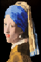
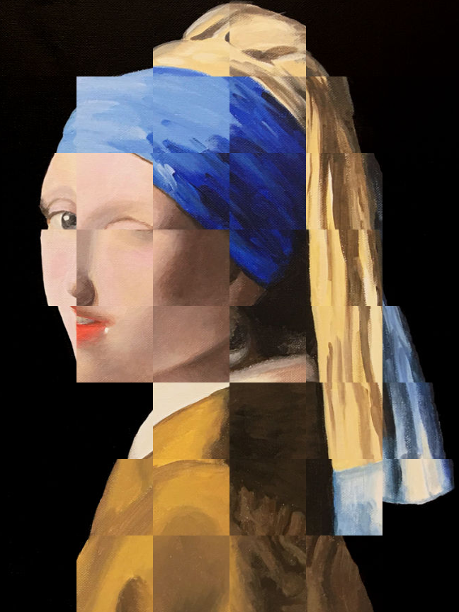
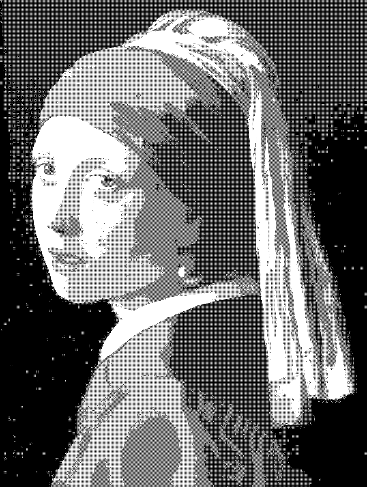
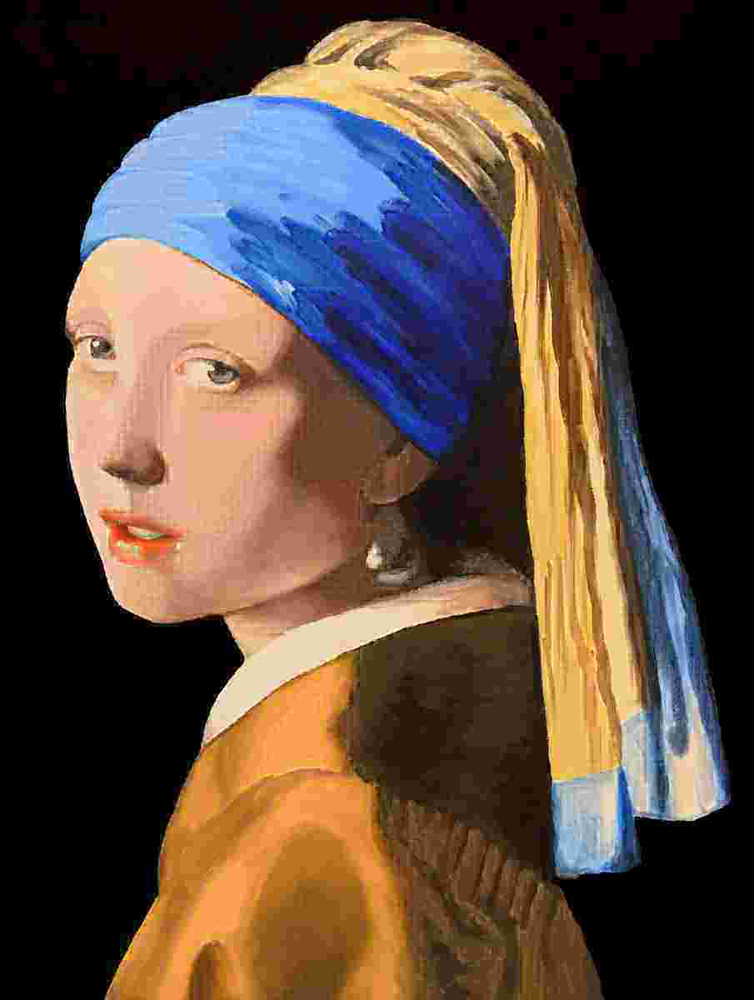

# Photography Compression Stuff

## What is it?
An unpolished set of filters I wrote to create artistic photo-compressions. This is pretty specific to my needs, but if it can interest others then go ahead!

## How to use it?
You're probably going to have to change some of the code yourself (like the input file path, the output file path, etc), but just to get the script to start up:

```
chmod u+x filters.py
./filters.py Some_File.png -save -show
```

Voila. -save saves a file and -show shows it, and neither of those tags are necessary.

You can also the edit the `images` array in filters.py to choose what filters you want to use.

## Examples:






Also the dithering setting is pretty much my limited rewrite of sloum's [lid](https://rawtext.club/~sloum/lid.html) so thanks.
